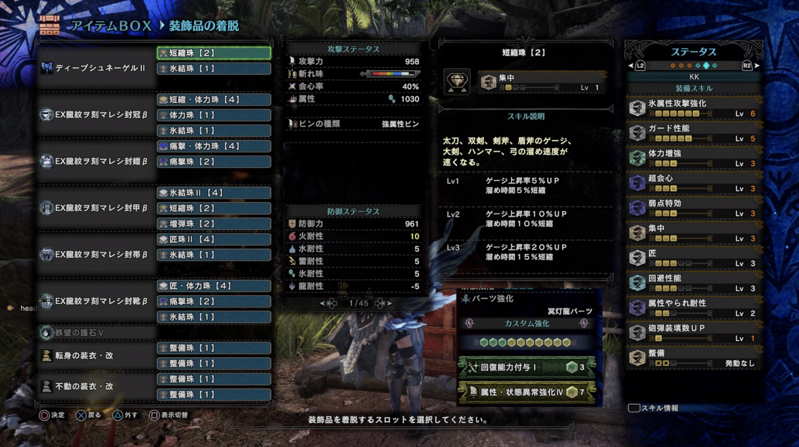
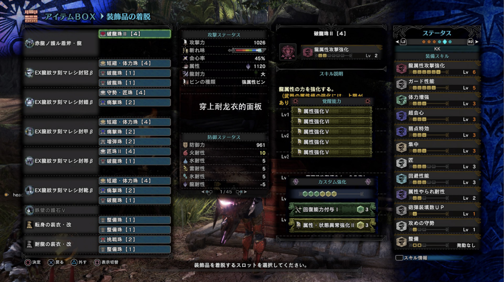
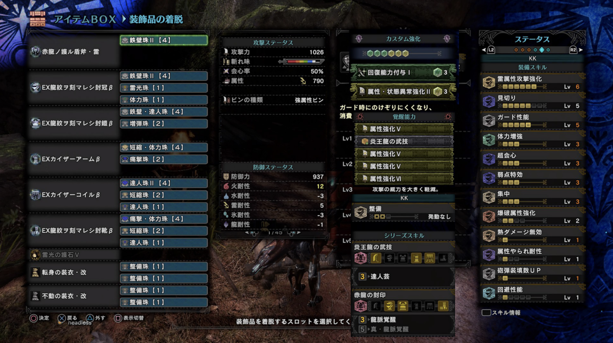
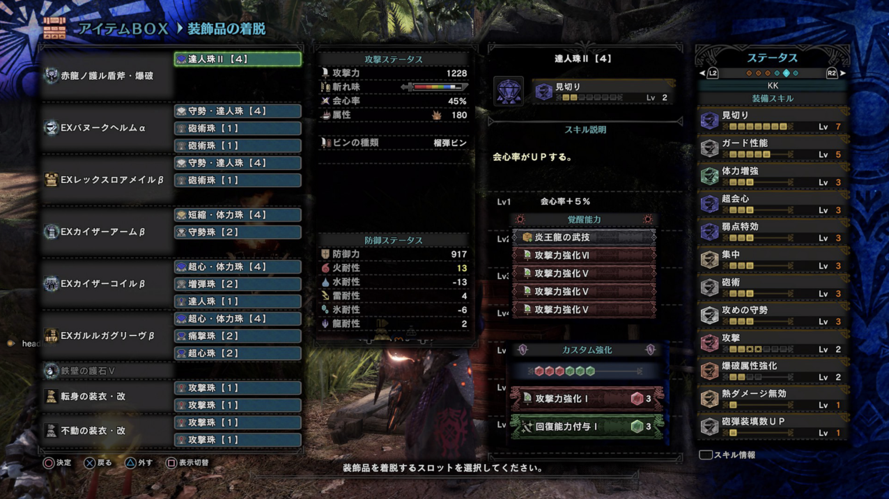

# 冥赤龙盾斧配装 20200105

### 前言
> 不知道大家冥赤龙刷爽了没有，第一轮冥赤龙明天就要结束了。这一次冥赤龙带来的装备中属性盾斧的提升十分显著，为了看各色特效的超解我也是肝了好多把觉醒了好多盾斧。
>
> 下面我想为大家介绍几套我常用的盾斧配装，这些配装面向的不是solo刷片出视频，而是**和队友们一起狩猎**。

### 正文

#### 主打超解的属性盾斧

属性盾斧带上冥赤龙5件套，属性值+150，真可谓是居家旅行，屠龙必备。

这种类型的盾斧输出的主要方式是超解，5件全用冥赤龙β。如果有俩匠II可以出到匠IV，可惜我没有。

下面是属性盾的大哥，深沉霜雪II（冰鱼龙盾斧）。在冥赤龙武器横行的今天，你大爷还是你大爷，为数不多还存活的素材武器。拔刀状态下1030的冰属性傲视群雄。

值得注意的是我出了防御性能V，在组队狩猎的时候十分安逸。**贴皮是前5级属性，第6级攻击，第7级斩味**。

如果觉得太怂了不想配防御性能5而想出更多的输出技能，请自行决定带几级，这儿有极佳的参考资料，我也不遑多言了。

> [从武器防御等级，防御性能，怪物招式威力到人物击退硬直。对着攻略书分析冰原各武器究竟需要防性几](https://bbs.nga.cn/read.php?tid=19096578&rand=323)

这套配装最初是参考自B站UP主鹅卵石的这期视频

> [【鹅卵石】赤龙套与属性盾斧更配哦【MHWI】](https://www.bilibili.com/video/av80040583)

鹅卵石说话幽默打猎技术又好还玩全武器，建议关注

接下来是另外的四属性盾斧，龙属性因为需要携带耐龙衣装所以在这里给出配装。另外的水雷火属性就把耐龙衣装下了换别的衣装即可（我一般带不动衣）

拔刀状态的930属性（龙盾耐龙衣1120属性）在超解打到属性吸收有30的部位时，一瓶子能超过300伤害。至于怪物的属性吸收如何，请参考官方的公式书或者别的wiki资料库。

#### 主打红斧的属性盾斧

武器出炎王龙词条，身上用冥赤龙β头胸腿和炎王龙β手腰。

冰原新增的红斧模式会在抡斧头的时候追加1到5段伤害，这当然就意味着斩味消耗会飞快。所以达人艺就是解决斩味问题的良药。

这一套的会心值在拔刀状态下打弱点是100%（赤龙3件20% + 看破25% + 弱特50% + 武器自带5%）

在怪物倒地的时候开起360°抡大斧头看到一大串黄字快感十足。

~~当然斧模式的△动作上撩击飞队友断人真蓄也饱受诟病~~

#### 榴弹瓶盾斧

武器需要出炎王龙词条（不考虑用γ炎王龙头，怕死)，才能多出到那么多技能。身上用巴努克α头，黑轰β胸，炎王龙β手腰，黑狼鸟β腿。

选用爆破盾斧蹭炎王腰的爆破II是葛朗台猎人的基本素养，但是老实说榴弹瓶的伤害比起属性瓶真的不太能看。

除非你还对怪物不熟悉，不知道打什么部位，追求稳定伤害的话可以尝试一下。

或者你精确打点，招招大解超解爆头，一场下来能用榴弹瓶晕怪个几次，请尽情使用。

### 后记

这里提及的配装权当抛砖引玉，我本身还是个盾斧新手，如果有什么说得不对的地方请大家不吝赐教。

盾斧的配装当然远不止这些，据说乌鸦大佬自己的盾斧配装弄了10页那么多。

在对付特殊的怪物或者应付特殊的场景的时候，还是需要更换一些技能的。

1. 打聚魔之地，把不屈和地学带上。
2. 打尸套龙，插上防强挡嘴炮，插上耐障
3. 打麒麟，插上耐雷III，换上耐雷衣
4. 给冥赤龙修脚破部位，插上破坏王III(当然是除了脚别的部位都被破了的前提下才去修脚)
5. 队友有双刀/太刀/虫棍等膝盖收割者，建议出一级耐冲（曾经被某鲈鱼双刀削得动不了，举盾duang，duang，duang不举盾也出不了招……）

十分感谢乌鸦大佬(@雀形目鸦种鸦科鸟类)在配装上的指导和各种建议。

如果大家有更多有趣的盾斧配装也请告诉我，祝苍蓝星们狩猎愉快。

发在NGA的：https://bbs.nga.cn/read.php?tid=19908430
发在B站专栏的：https://www.bilibili.com/read/cv4295373